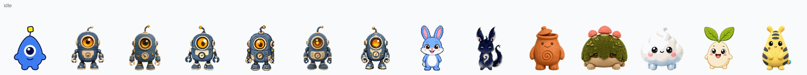
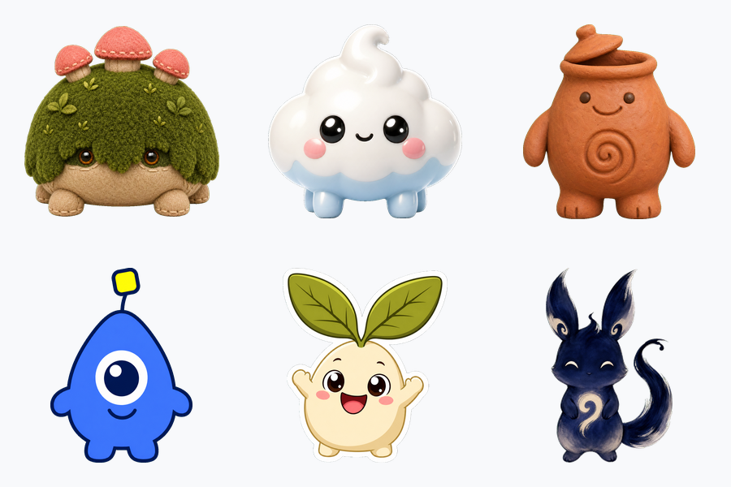
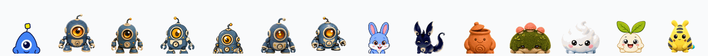
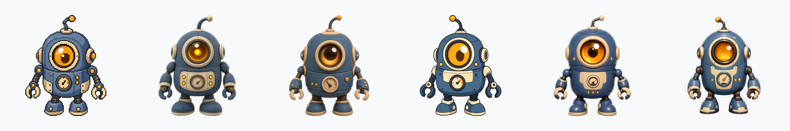
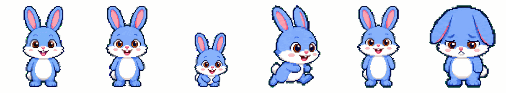
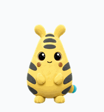
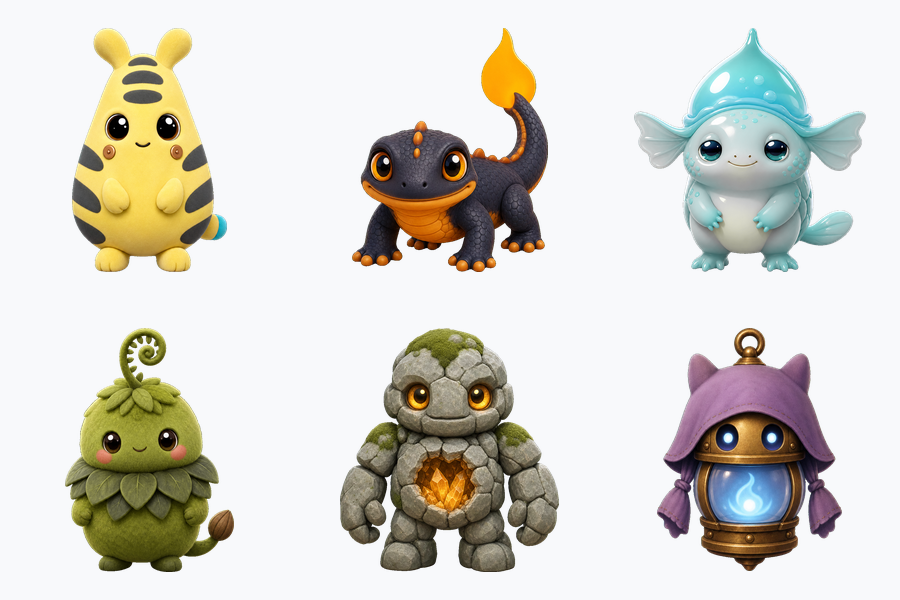
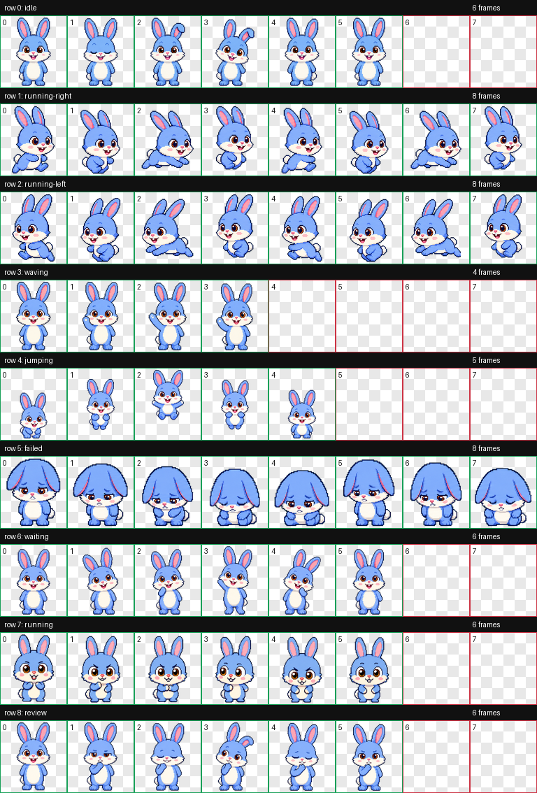

# 🐣 hatch-pet-plus — make any Codex pet, in any style

A plugin for **Codex** and **Claude Code** that turns a concept — or a piece of character art — into a
fully animated Codex pet. Plus **[14 ready-to-install pets](pets/)** — one of which **evolves** — and
free CC0 mascot art.

<p align="center">
  
</p>

<p align="center">
  <em>14 complete pets, playing each of the nine lanes in turn — every one a full 8×11 atlas:
  9 animation lanes + 16 look directions, all validated</em>
</p>

Every one is built end-to-end and passes independent QA, and
**[every pet has its own page](pets/)** with lane-by-lane detail measured from its atlas. Grab any:

```bash
cp -r pets/mossback ~/.codex/pets/
```

<p align="center">
  
</p>

<p align="center">
  <em>Mossback · Nimbus · Kiln · Blip · Pip · Inko — six original mascots, six styles, all invented from a text concept alone</em>
</p>

Hover a pet and it hops. That is the animation you will see more than any other:

<p align="center">
  
</p>

---

## It is not just pixel art, and not just animals

The style is a dial. Here is the **same** robot — *Sprocket* — rendered across six style presets:

<p align="center">
  
</p>

<p align="center">
  <em>pixel · plush · clay · flat-vector · 3d-toy · sticker</em>
</p>

| preset | look |
| --- | --- |
| `pixel` | chunky retro sprite, limited flat palette |
| `plush` | felt / soft toy, stitched seams, fabric weave |
| `clay` | claymation, thumbprints, matte earthenware |
| `sticker` | die-cut vinyl, bold white border, glossy |
| `flat-vector` | clean geometric shapes, flat fills, no texture |
| `3d-toy` | glossy moulded vinyl, studio highlights |
| `painterly` | brushstrokes, pigment, expressive edges |
| `brand-inspired` | derived from a company's visual system |
| `auto` | inferred from your prompt (default) |

The mascot can be anything — a creature, an object, a plant, a shape, a company mascot. It does not
have to be an animal.

---

## Two ways in — both first-class

**From a concept.** No art needed. Every mascot in the gallery above was invented from a sentence.

```
/hatch-pet a pot-bellied terracotta jar-creature with a lid for a hat, claymation style
```

**From reference art.** Anchor the identity to images you already have.

```
/hatch-pet turn these three character sheets into a pet   (attach the images)
```

**Bunny** was built the second way, from three reference renders. The other 12 came from a sentence.

<p align="center">
  
</p>

<p align="center">
  <em>idle · waving · jumping · running · review · failed</em>
</p>

---

## Pets that evolve

A pet can have more than one form. It hatches as its first, and transforms into the next when it has
levelled up enough — because *you* coded enough.

<p align="center">
  
</p>

<p align="center">
  <em>the sprite blows out to a white silhouette, the silhouette itself changes, and the new form fades in</em>
</p>

An evolving pet declares `stages` in its `pet.json`. Each stage is a **complete 8×11 atlas** unlocked at
a level:

```jsonc
{
  "id": "volt",
  "spritesheetPath": "stage-1.webp",     // ← stage one, so hosts that never heard of `stages` still work
  "stages": [
    { "minLevel": 0,  "name": "Volt",    "spritesheetPath": "stage-1.webp",
      "attributes": { "type": "electric", "hp": 50, "atk": 58, "def": 46, "spd": 48 } },
    { "minLevel": 10, "name": "Anodane", "spritesheetPath": "stage-2.webp",
      "attributes": { "type": "electric", "hp": 68, "atk": 90, "def": 62, "spd": 65 } }
  ]
}
```

**Backwards compatibility is the whole design.** Every pet published before this has no `stages`, gets
one implicit stage, and is unaffected. Codex itself knows nothing about evolution — it reads
`spritesheetPath`, shows the first form, and works.

**An evolution is not the same pet, bigger.** A scaled-up sprite just reads as the same creature standing
closer. What sells a transformation is a change of *silhouette* and of *character*, chosen for that
specific creature:

| | first form | evolves into | what actually changes | |
|---|---|---|---|---|
| ⚡ | **Volt** | **Anodane** | its plush fuzz cures to hard enamel; it grows a copper grounding collar and a ceramic earthing spike where its tail tip was | **[built](pets/volt/)** |
| 🔥 | **Firetail** | **Emberkiln** | a kiln-fired ceramic carapace grows over its back — a furnace that *holds* its heat, not a lizard carrying a candle | [spec](specs/firetail.json) |
| 🪨 | **Cobble** | **Cairnvault** | the geode in its chest cracks open | [spec](specs/cobble.json) |
| 🌱 | **Sprig** | **Verdicoil** | the curled frond unfurls | [spec](specs/sprig.json) |
| 💧 | **Dewel** | **Dewelm** | the droplet shell crystallises | [spec](specs/dewel.json) |
| 👻 | **Wisp** | **Tollwarden** | the hood becomes a cloak and the flame burns cold | [spec](specs/wisp.json) |

Gear. Materials. An ignition. A posture. *Then* size, if it helps at all.

**Volt is built.** The other five have complete art direction in [`specs/`](specs/) — the transformation,
the identity anchors that must survive it, the image prompt, and the stats — and their first-form art is
in [`assets/elemental/`](assets/elemental/), CC0. Building one is a single command; it is not free, which
is the honest reason they are not all built yet:

```bash
scripts/e2e_evolve.sh specs/firetail.json     # ~23 image generations — roughly 15% of a weekly Codex quota

# or build several, stopping before it eats your allowance:
scripts/evolve_all.sh 75 specs/*.json         # checks quota before each pet, and says what it skipped
```

Every design was reviewed for derivativeness before it was drawn. Volt's first evolution kept cheek-sparks
and a lightning-bolt tail — a Pikachu/Raichu beat — and was rejected and redesigned. What shipped has
neither.

Full format and build guide: **[docs/EVOLUTION.md](docs/EVOLUTION.md)**.

**Or evolve for free.** A stage just needs to be a full atlas, and we ship 14 — so an evolving pet
can *chain existing pets* as its stages, no generation at all. The shipped **Sprocket** line is the
same robot re-rendering itself pixel → vector → 3D as you level up:

<p align="center">
  
</p>

```bash
scripts/assemble_evolution_line.py specs/lines/sprocket-evo.json   # 0 images generated
```

> **Who actually evolves them?** Codex shows a pet's first form and never levels it up. To *see* a pet
> evolve you need a host that tracks your coding and knows about `stages` — like
> **[evolvepet](https://github.com/leduy-it/evolvepet)**, a desktop pet that watches your agents work.

---

## Install

### Plugin — marketplace

**Claude Code**

```
/plugin marketplace add leduy-it/hatch-pet-plus
/plugin install hatch-pet-plus@leduy-pets
```

**Codex** — register `~/.codex/plugins/hatch-pet-plus` in `~/.agents/plugins/marketplace.json`:

```json
{
  "name": "personal",
  "interface": { "displayName": "Personal Plugins" },
  "plugins": [
    {
      "name": "hatch-pet-plus",
      "source": { "source": "local", "path": "~/.codex/plugins/hatch-pet-plus" },
      "policy": { "installation": "AVAILABLE" },
      "category": "Creative"
    }
  ]
}
```

### Plugin — local

```bash
git clone https://github.com/leduy-it/hatch-pet-plus.git
cd hatch-pet-plus
./install.sh                 # plugin, both hosts
./install.sh --codex         # Codex only
./install.sh --claude        # Claude Code only
./install.sh --list          # list the 14 pets
./install.sh --pet           # install ALL 14 pets
./install.sh --pet mossback  # install one
```

One plugin directory carries **both manifests** (`.codex-plugin/` and `.claude-plugin/`) and shares a
single `skills/` folder, so it installs into either host.

> Image generation needs a host with an image tool. Codex has built-in `image_gen`; Claude Code does
> not — from there the plugin delegates generation to Codex via `codex exec`.

### The pets

```bash
./install.sh --pet mossback     # or any of the 14
./install.sh --pet              # all of them
```

Then **Codex Settings → Appearance / Pets → pick one**, and `/pet` to wake it.

Every pet has **[its own page](pets/)**: what plays each animation, the frame count and sprite height
of every lane (measured, not asserted), the full contact sheet, its QA report, and the canonical base
art all 88 of its drawings were generated against.

---

## Free mascot assets

Everything in [`assets/`](assets/) is **CC0 / public domain** — use it for anything, no attribution needed.
That is **19 original mascots**: 6 characters, 6 styles of one robot, and 6 elemental creatures.

<p align="center">
  
</p>

<p align="center">
  <em>Volt · Firetail · Dewel · Sprig · Cobble · Wisp — six original elementals, each with a designed evolution</em>
</p>

Each mascot ships as a raw `base.png` (chroma-screen, for feeding back into the pipeline) and a
despilled transparent `cutout.png` (ready to drop into a game, slide or app). The full art direction
for every evolution — transformation, identity anchors, image prompt, stats — is in [`specs/`](specs/).

See [assets/README.md](assets/README.md).

> These are deliberately **not** Pokémon. We declined to generate any: they are Nintendo/Game Freak's
> intellectual property, and we cannot license someone else's characters CC0. Art you cannot legally
> use would be worse than no art.

---

## What a pet actually is

An **8 × 11 grid** of `192×208` cells (`1536×2288`, `spriteVersionNumber: 2`).
Rows 0–8 are animation states; rows 9–10 are 16 look directions.

**You trigger these:**

| Action | Animation |
| --- | --- |
| **Hover** the pet | `jumping` |
| **Drag** it right / left | `running-right` / `running-left` |
| **Move your cursor** | rows 9–10 — the pet's head *follows your pointer* |

**Codex triggers these:**

| When Codex is… | Animation |
| --- | --- |
| idle | `idle` |
| working / thinking | `running` (not foot-running) |
| blocked on your approval | `waiting` |
| reviewing output | `review` |
| failed / cancelled | `failed` |

<p align="center">
  
</p>

---

## Style affects how well it cuts out

The pipeline keys the pet off a flat green screen into transparent cells. **Soft styles key badly.**
Measured green contamination on the silhouette edge of a fresh base:

| style | before despill | after |
| --- | --- | --- |
| `flat-vector` | 9.1% | **0.0%** |
| `clay` | 11.2% | **0.0%** |
| `sticker` | 15.0% | **0.0%** |
| `3d-toy` | 16.1% | **0.0%** |
| `plush` | 17.1% | **0.0%** |
| `painterly` | 19.2% | **0.0%** |

Hard geometric edges key cleanest; wispy brush edges are worst. **No style is clean out of the box** —
they all need the despill pass, which fixes every one of them completely.

---

## 📌 Lessons learned

Full write-up: **[docs/LESSONS.md](docs/LESSONS.md)**. The greatest hits:

- **`codex exec --profile` is broken** on codex-cli ≥ 0.139 — and it **exits 0** while doing nothing.
- **Subagents deadlock** in headless `codex exec`. Call `image_gen` inline; parallelise with one process per row.
- **A model will print `OUT=<path>` without ever generating the file.** Verify the artifact, never the report. (This cost us 3 of 6 mascots on the first run.)
- **Despill before extracting**, and match the extractor's threshold (**96**, not 120).
- **Write the final WebP lossless** — the default lossy encoder corrupts RGB in transparent pixels.
- **Diffusion models can't make *true* pixel art**, and you cannot fix it by downscaling.
- **Gaze comes from the head, not the pupils** — pupil shifts measured under 2px are invisible.
- **Measure, don't eyeball.** Nearly every real defect was caught by a script.

---

## Repo layout

```
plugins/hatch-pet-plus/     the dual-host plugin
  ├── .codex-plugin/          Codex manifest
  ├── .claude-plugin/         Claude Code manifest
  ├── skills/hatch-pet/       the skill (shared by both hosts)
  ├── commands/hatch-pet.md   /hatch-pet
  └── scripts/                the build pipeline, hardening + QA, evolution
.claude-plugin/             makes this repo a Claude Code marketplace
pets/                       installable pets (atlas, contact sheet, per-lane GIFs, validation)
specs/                      evolution art direction — transformation, anchors, prompt, stats
assets/                     free CC0 mascot art (base + transparent cutout)
examples/                   showcases, contact sheet, preview GIFs
docs/EVOLUTION.md           the stages format, and how to build an evolving pet
docs/LESSONS.md             everything that went wrong, and what fixed it
install.sh                  local install for both hosts
```

---

## Licensing

- **`assets/`** — CC0 / public domain. Use freely.
- **`plugins/hatch-pet-plus/skills/hatch-pet/`** — OpenAI's [`hatch-pet`](https://github.com/openai/skills/tree/main/skills/.curated/hatch-pet) skill; its own licence applies (see the LICENSE.txt in that directory).
- **Everything else** (plugin wrapper, installer, docs) — MIT.
