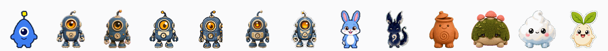

# 🐣 hatch-pet-plus — make any Codex pet, in any style

A plugin for **Codex** and **Claude Code** that turns a concept — or a piece of character art — into a
fully animated Codex pet. Plus **[13 ready-to-install pets](pets/)** and free CC0 mascot art.

<p align="center">
  
</p>

<p align="center">
  <em>13 complete pets — each a full 8×11 atlas: 9 animation lanes + 16 look directions, all validated</em>
</p>

Every one is built end-to-end and passes independent QA. Grab any of them:

```bash
cp -r pets/mossback ~/.codex/pets/
```

<p align="center">
  
</p>

<p align="center">
  <em>Mossback · Nimbus · Kiln · Blip · Pip · Inko — six original mascots, six styles, all invented from a text concept alone</em>
</p>

---

## It is not just pixel art, and not just animals

The style is a dial. Here is the **same** robot — *Sprocket* — rendered across six style presets:

<p align="center">
  
</p>

<p align="center">
  <em>pixel · plush · clay · flat-vector · 3d-toy · sticker</em>
</p>

| preset | look |
| --- | --- |
| `pixel` | chunky retro sprite, limited flat palette |
| `plush` | felt / soft toy, stitched seams, fabric weave |
| `clay` | claymation, thumbprints, matte earthenware |
| `sticker` | die-cut vinyl, bold white border, glossy |
| `flat-vector` | clean geometric shapes, flat fills, no texture |
| `3d-toy` | glossy moulded vinyl, studio highlights |
| `painterly` | brushstrokes, pigment, expressive edges |
| `brand-inspired` | derived from a company's visual system |
| `auto` | inferred from your prompt (default) |

The mascot can be anything — a creature, an object, a plant, a shape, a company mascot. It does not
have to be an animal.

---

## Two ways in — both first-class

**From a concept.** No art needed. Every mascot in the gallery above was invented from a sentence.

```
/hatch-pet a pot-bellied terracotta jar-creature with a lid for a hat, claymation style
```

**From reference art.** Anchor the identity to images you already have.

```
/hatch-pet turn these three character sheets into a pet   (attach the images)
```

**Bunny** was built the second way, from three reference renders. The other 12 came from a sentence.

<p align="center">
  
</p>

<p align="center">
  <em>idle · waving · jumping · running · review · failed</em>
</p>

---

## Install

### Plugin — marketplace

**Claude Code**

```
/plugin marketplace add leduy-it/hatch-pet-plus
/plugin install hatch-pet-plus@leduy-pets
```

**Codex** — register `~/.codex/plugins/hatch-pet-plus` in `~/.agents/plugins/marketplace.json`:

```json
{
  "name": "personal",
  "interface": { "displayName": "Personal Plugins" },
  "plugins": [
    {
      "name": "hatch-pet-plus",
      "source": { "source": "local", "path": "~/.codex/plugins/hatch-pet-plus" },
      "policy": { "installation": "AVAILABLE" },
      "category": "Creative"
    }
  ]
}
```

### Plugin — local

```bash
git clone https://github.com/leduy-it/hatch-pet-plus.git
cd hatch-pet-plus
./install.sh                 # plugin, both hosts
./install.sh --codex         # Codex only
./install.sh --claude        # Claude Code only
./install.sh --list          # list the 13 pets
./install.sh --pet           # install ALL 13 pets
./install.sh --pet mossback  # install one
```

One plugin directory carries **both manifests** (`.codex-plugin/` and `.claude-plugin/`) and shares a
single `skills/` folder, so it installs into either host.

> Image generation needs a host with an image tool. Codex has built-in `image_gen`; Claude Code does
> not — from there the plugin delegates generation to Codex via `codex exec`.

### The pets

```bash
./install.sh --pet mossback     # or any of the 13
./install.sh --pet              # all of them
```

Then **Codex Settings → Appearance / Pets → pick one**, and `/pet` to wake it.
See **[pets/](pets/)** for the full list, lane-by-lane detail, and each pet's QA report.

---

## Free mascot assets

Everything in [`assets/`](assets/) is **CC0 / public domain** — use it for anything, no attribution needed.

Each mascot ships as a raw `base.png` (green-screen, for feeding back into the pipeline) and a
despilled transparent `cutout.png` (ready to drop into a game, slide or app).

See [assets/README.md](assets/README.md).

---

## What a pet actually is

An **8 × 11 grid** of `192×208` cells (`1536×2288`, `spriteVersionNumber: 2`).
Rows 0–8 are animation states; rows 9–10 are 16 look directions.

**You trigger these:**

| Action | Animation |
| --- | --- |
| **Hover** the pet | `jumping` |
| **Drag** it right / left | `running-right` / `running-left` |
| **Move your cursor** | rows 9–10 — the pet's head *follows your pointer* |

**Codex triggers these:**

| When Codex is… | Animation |
| --- | --- |
| idle | `idle` |
| working / thinking | `running` (not foot-running) |
| blocked on your approval | `waiting` |
| reviewing output | `review` |
| failed / cancelled | `failed` |

<p align="center">
  
</p>

---

## Style affects how well it cuts out

The pipeline keys the pet off a flat green screen into transparent cells. **Soft styles key badly.**
Measured green contamination on the silhouette edge of a fresh base:

| style | before despill | after |
| --- | --- | --- |
| `flat-vector` | 9.1% | **0.0%** |
| `clay` | 11.2% | **0.0%** |
| `sticker` | 15.0% | **0.0%** |
| `3d-toy` | 16.1% | **0.0%** |
| `plush` | 17.1% | **0.0%** |
| `painterly` | 19.2% | **0.0%** |

Hard geometric edges key cleanest; wispy brush edges are worst. **No style is clean out of the box** —
they all need the despill pass, which fixes every one of them completely.

---

## 📌 Lessons learned

Full write-up: **[docs/LESSONS.md](docs/LESSONS.md)**. The greatest hits:

- **`codex exec --profile` is broken** on codex-cli ≥ 0.139 — and it **exits 0** while doing nothing.
- **Subagents deadlock** in headless `codex exec`. Call `image_gen` inline; parallelise with one process per row.
- **A model will print `OUT=<path>` without ever generating the file.** Verify the artifact, never the report. (This cost us 3 of 6 mascots on the first run.)
- **Despill before extracting**, and match the extractor's threshold (**96**, not 120).
- **Write the final WebP lossless** — the default lossy encoder corrupts RGB in transparent pixels.
- **Diffusion models can't make *true* pixel art**, and you cannot fix it by downscaling.
- **Gaze comes from the head, not the pupils** — pupil shifts measured under 2px are invisible.
- **Measure, don't eyeball.** Nearly every real defect was caught by a script.

---

## Repo layout

```
plugins/hatch-pet-plus/     the dual-host plugin
  ├── .codex-plugin/          Codex manifest
  ├── .claude-plugin/         Claude Code manifest
  ├── skills/hatch-pet/       the skill (shared by both hosts)
  └── commands/hatch-pet.md   /hatch-pet
.claude-plugin/             makes this repo a Claude Code marketplace
  └── scripts/                hardening + QA scripts
pets/                       13 installable pets (atlas, contact sheet, per-lane GIFs, validation)
assets/                     free CC0 mascot art (base + transparent cutout)
examples/                   showcases, contact sheet, preview GIFs
docs/LESSONS.md             the full write-up
install.sh                  local install for both hosts
```

---

## Licensing

- **`assets/`** — CC0 / public domain. Use freely.
- **`plugins/hatch-pet-plus/skills/hatch-pet/`** — OpenAI's [`hatch-pet`](https://github.com/openai/skills/tree/main/skills/.curated/hatch-pet) skill; its own licence applies (see the LICENSE.txt in that directory).
- **Everything else** (plugin wrapper, installer, docs) — MIT.
