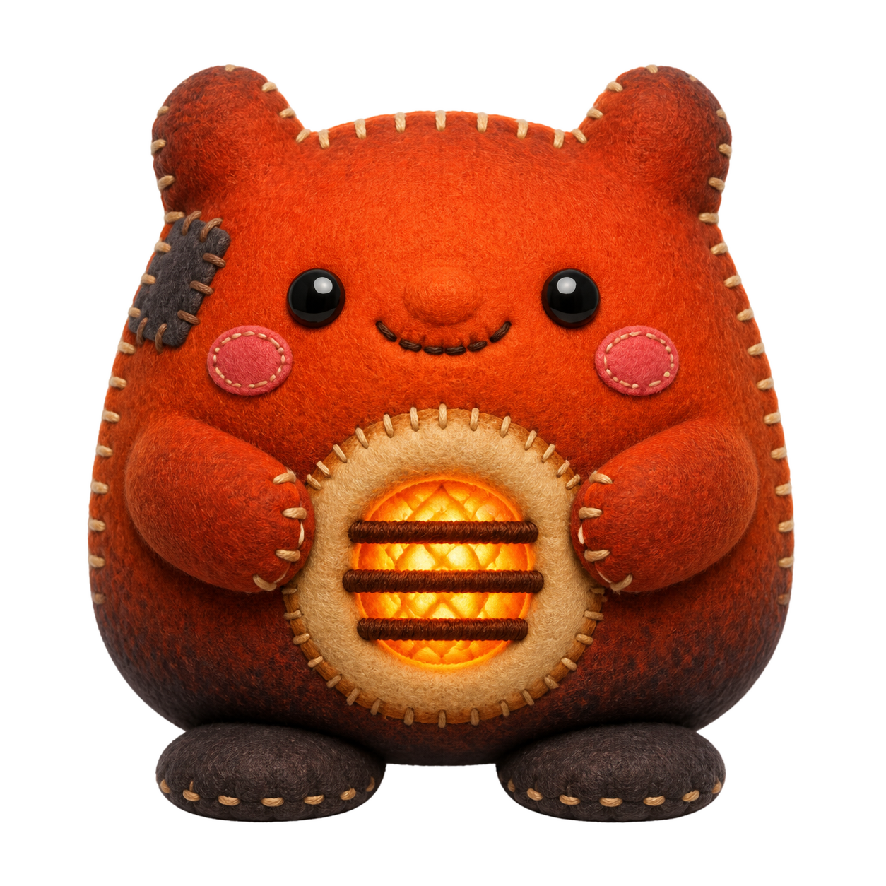

# Mascot pack — extra CC0 characters

Original creatures generated from the designs in [`specs/mascots/`](../../specs/mascots/), free to
use for anything ([CC0](../LICENSE) — public domain, no attribution).

Each ships as a `base.png` (on white) and a despilled transparent `cutout.png`, ready to drop into a
game, slide, README or app.

| | mascot | style |
|---|---|---|
|  | **Cinderbun** — a felt hearth-creature with a live coal glowing in its belly | `plush` |

More designs are ready to generate in [`specs/mascots/`](../../specs/mascots/); base-art generation
is quota-heavy (~7% of a weekly Codex window per image), so they are added as quota allows.
