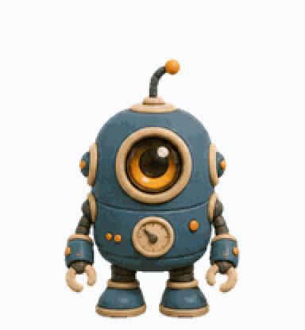
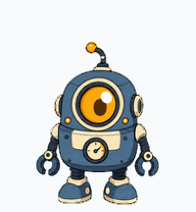
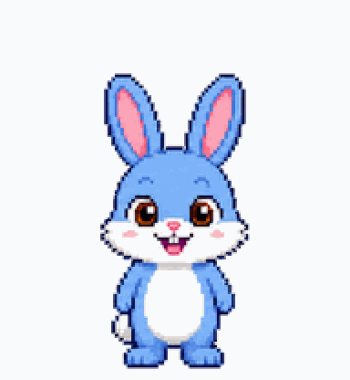
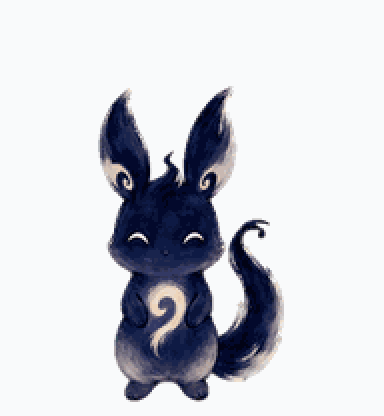
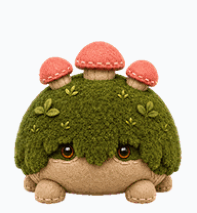
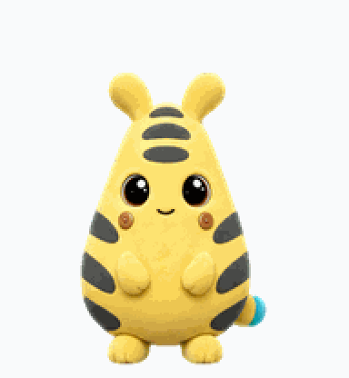
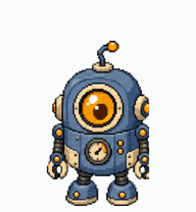

# 14 ready-to-install Codex pets

Every pet here is **complete and validated** — a full 8×11 v2 atlas with all 9 animation lanes
and 16 look directions. Each has its own page with lane-by-lane detail.

<p align="center">
  
</p>

## The pets

| | pet | style | |
|---|---|---|---|
|  | **[Blip](blip/)** | `flat-vector` |  |
|  | **[Sprocket Toy](bot-3d-toy/)** | `3d-toy` |  |
|  | **[Sprocket Clay](bot-clay/)** | `clay` |  |
|  | **[Sprocket Vector](bot-flat-vector/)** | `flat-vector` |  |
|  | **[Sprocket Pixel](bot-pixel/)** | `pixel` |  |
|  | **[Sprocket Plush](bot-plush/)** | `plush` |  |
|  | **[Sprocket Sticker](bot-sticker/)** | `sticker` |  |
|  | **[Bunny](bunny/)** | `pixel` |  |
|  | **[Inko](inko/)** | `painterly` |  |
|  | **[Kiln](kiln/)** | `clay` |  |
|  | **[Mossback](mossback/)** | `plush` |  |
|  | **[Nimbus](nimbus/)** | `3d-toy` |  |
|  | **[Pip](pip/)** | `sticker` |  |
|  | **[Volt](volt/)** | `3d-toy` | **evolves** — Volt → Anodane |

---

## Evolution lines — built from existing pets, zero new art

<p align="center">
  
</p>

A stage does not have to be *new* art — it just has to be a full atlas, and we already ship
14 of them. These pets **chain existing atlases as their stages**, so they evolve as you level
up without a single image being generated. Define your own in one small JSON file:
`scripts/assemble_evolution_line.py <line.json>`.

| | line | evolves |
|---|---|---|
|  | **[Pip](grove-evo/)** | Pip (Lv 0) → Mossback (Lv 12) |
|  | **[Sprocket](sprocket-evo/)** | Sprocket 8-bit (Lv 0) → Sprocket Vector (Lv 8) → Sprocket HD (Lv 20) |

---

## Install

```bash
./install.sh --pet <name>     # one
./install.sh --pet            # all of them
```

An evolving pet installs its first form into Codex (which cannot level pets up) and, if you have
[evolvepet](https://github.com/leduy-it/evolvepet), every stage into it. Format and build guide:
**[../docs/EVOLUTION.md](../docs/EVOLUTION.md)**.

