# Cobble

> Cobble — a stout grey stone golem of stacked rounded rocks with moss on its crown, heavy blocky arms, glowing amber eyes, and an amber geode set into its chest.

<p align="center">
  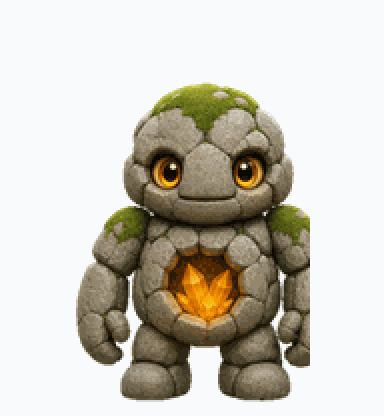
</p>

| | |
|---|---|
| **style** | `3d-toy` |
| **atlas** | 8 × 11 cells of 192×208 — `1536×2288`, `spriteVersionNumber: 2` |
| **chroma key** | `#00FFFF` (keyed to transparency, then despilled) |

## Every animation, and what plays it

| | lane | plays when | frames | sprite height |
|---|---|---|---|---|
| 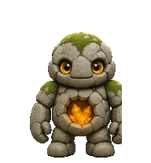 | `idle` | Codex is idle <br><sub>the default resting loop</sub> | 6 | 160px |
| 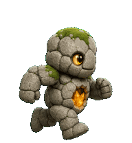 | `running-right` | **you drag it right** <br><sub>travels right with a walking cadence</sub> | 8 | 159px |
| 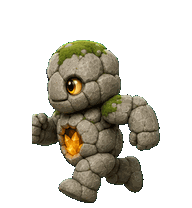 | `running-left` | **you drag it left** <br><sub>the mirror of running-right</sub> | 8 | 159px |
|  | `waving` | greeting <br><sub>a friendly wave</sub> | 4 | 159px |
| 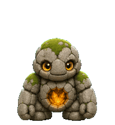 | `jumping` | **you hover it** <br><sub>a small joyful hop — the most-seen animation</sub> | 5 | 158px |
| 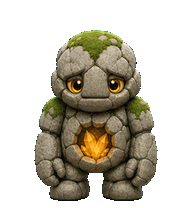 | `failed` | Codex failed or was cancelled <br><sub>deflated, disappointed</sub> | 8 | 158px |
| 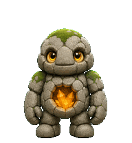 | `waiting` | Codex is blocked on you <br><sub>an expectant, asking pose</sub> | 6 | 159px |
| 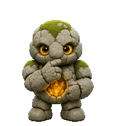 | `running` | Codex is working / thinking <br><sub>focused effort — *not* foot-running</sub> | 6 | 159px |
| 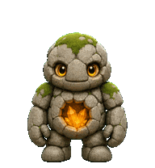 | `review` | Codex is reviewing output <br><sub>leaning in, inspecting</sub> | 6 | 160px |

Rows 9 and 10 are the **16 look directions**: as you move your cursor, the pet's head turns to follow it, in 22.5° steps.

The pet is drawn the **same size in every lane** (spread 1%), so it does not visibly resize when you hover or drag it.

## All 11 rows

<p align="center">
  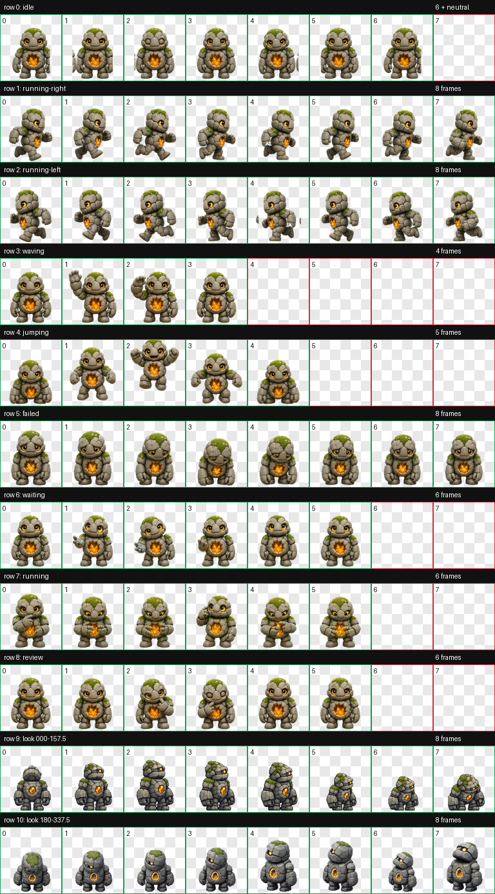
</p>

## QA

```
cobble PASS key=#00FFFF lean=0.0% ring=5% spread=1%
```

`lean` = pixels still tinted by the chroma key · `ring` = background baked into the sprite · `spread` = how much the pet resizes between lanes. All must be near zero.

## The base art everything was generated from

<p align="center">
  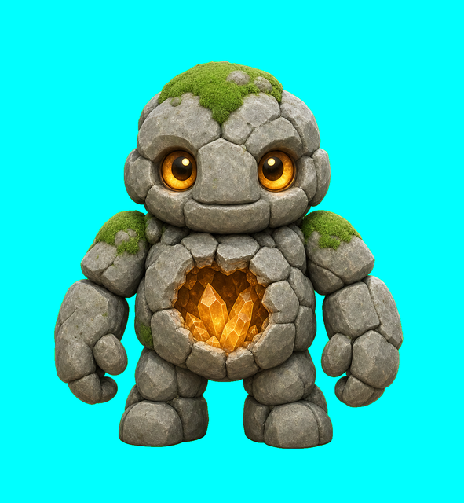
</p>

Every one of the 88 drawings in the atlas was generated against this single canonical reference, which is what keeps the identity stable across all of them.

## Install

```bash
./install.sh --pet cobble
```

Then **Codex Settings → Appearance / Pets**, and `/pet` to wake it.

