# Sprocket

> Sprocket — a desk robot that upgrades its own graphics the more you code. It evolves by re-rendering itself at higher fidelity.

<p align="center">
  
</p>

| | |
|---|---|
| **style** | `auto` |
| **atlas** | 8 × 11 cells of 192×208 — `1536×2288`, `spriteVersionNumber: 2` |
| **chroma key** | `#00FF00` (keyed to transparency, then despilled) |
| **evolves** | **Sprocket 8-bit** (Lv 0) → **Sprocket Vector** (Lv 8) → **Sprocket HD** (Lv 20) |
| **type** | `machine` |

## Evolution

<p align="center">
  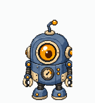
</p>

| stage | reached at | stats |
|---|---|---|
| **Sprocket 8-bit** | Lv 0 | HP 38 · ATK 42 · DEF 34 · SPD 46 |
| **Sprocket Vector** | Lv 8 | HP 52 · ATK 58 · DEF 48 · SPD 60 |
| **Sprocket HD** | Lv 20 | HP 74 · ATK 82 · DEF 68 · SPD 78 |

Each stage is a **complete 8×11 atlas** — see [docs/EVOLUTION.md](../../docs/EVOLUTION.md).

## Every animation, and what plays it

| | lane | plays when | frames | sprite height |
|---|---|---|---|---|
| 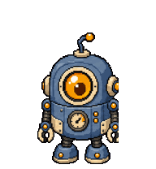 | `idle` | Codex is idle <br><sub>the default resting loop</sub> | 6 | 159px |
| 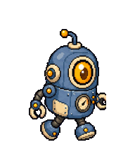 | `running-right` | **you drag it right** <br><sub>travels right with a walking cadence</sub> | 8 | 157px |
| 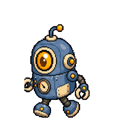 | `running-left` | **you drag it left** <br><sub>the mirror of running-right</sub> | 8 | 157px |
| 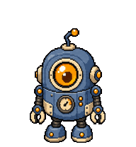 | `waving` | greeting <br><sub>a friendly wave</sub> | 4 | 161px |
| 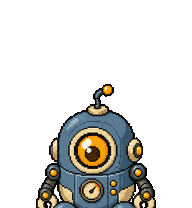 | `jumping` | **you hover it** <br><sub>a small joyful hop — the most-seen animation</sub> | 5 | 161px |
| 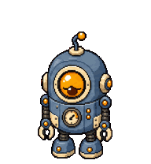 | `failed` | Codex failed or was cancelled <br><sub>deflated, disappointed</sub> | 8 | 142px |
| 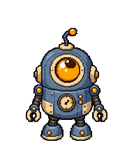 | `waiting` | Codex is blocked on you <br><sub>an expectant, asking pose</sub> | 6 | 161px |
| 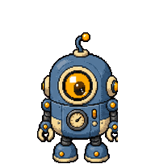 | `running` | Codex is working / thinking <br><sub>focused effort — *not* foot-running</sub> | 6 | 157px |
| 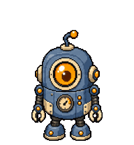 | `review` | Codex is reviewing output <br><sub>leaning in, inspecting</sub> | 6 | 159px |

Rows 9 and 10 are the **16 look directions**: as you move your cursor, the pet's head turns to follow it, in 22.5° steps.

The pet is drawn the **same size in every lane** (spread 12%), so it does not visibly resize when you hover or drag it.

## All 11 rows

<p align="center">
  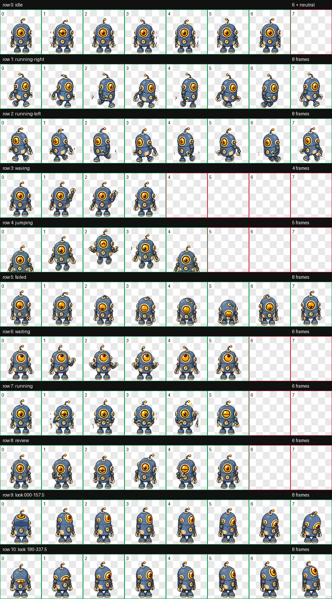
</p>

## Composed from existing pets

This evolution line reuses atlases that already ship in this repo — **no new art was generated**. Each stage is one of the finished, QA-passed pets:

- **Sprocket 8-bit** — `stage-1.webp`
- **Sprocket Vector** — `stage-2.webp`
- **Sprocket HD** — `stage-3.webp`

## Install

```bash
./install.sh --pet sprocket-evo
```

Then **Codex Settings → Appearance / Pets**, and `/pet` to wake it.

